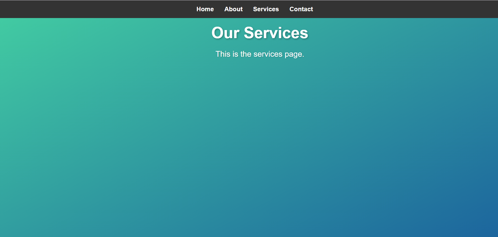

# CSS Only Multi-Page Website Simulator

This project is a fully functional, multi-section website that simulates the experience of navigating between different pages—all created using **CSS only**. It leverages the `:target` pseudo-class and CSS animations to create smooth transitions between sections

## Question

**Objective:**  
Create a fully functional, multi-section website that simulates the experience of navigating between different pages—all without any JavaScript.

**Requirements:**
- Use the `:target` pseudo-class to display and hide different “pages” or sections of content.
- Incorporate CSS animations and transitions to simulate page transitions (such as fading or sliding effects).
- Design an accessible navigation menu that works across different devices and screen sizes.
- Ensure that the entire experience is responsive and leverages advanced CSS techniques (e.g., combining Flexbox, Grid, and pseudo-classes) to manage layout and state transitions.

## Features

- **CSS-Only Navigation:** No JavaScript is used; navigation is handled entirely with CSS.
- **Responsive Design:** The layout adapts to different screen sizes using Flexbox and media queries.
- **Gradient Backgrounds:** Each page has a unique gradient background for a visually appealing design.
- **Smooth Transitions:** CSS transitions are used to create fade-in effects when switching between pages.
- **Accessible Navigation:** A fixed navigation bar ensures easy access to all sections.

## Screenshots

### Home

### About Page

### Service

