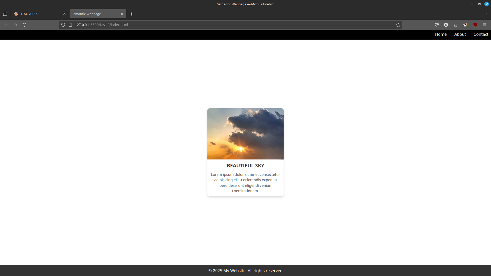

# Task 2: Card Component Webpage

## Overview

This project demonstrates a simple webpage with a **card component** designed using HTML and CSS. The card includes an image, a title, and a description, styled with hover effects for a modern and interactive look.

## Features

- **Card Component**:
  - Includes an image, title, and description.
  - Styled with rounded corners, shadows, and hover effects.
- **Responsive Layout**:
  - The card is centered on the webpage using Flexbox.
  - Adapts well to different screen sizes.
- **Clean Design**:
  - Minimalistic and visually appealing styling.

## Preview

The webpage includes:
- **Header**: A simple navigation bar.
- **Main Section**: A centered card with:
  - **Image**: Displays a beautiful sky.
  - **Title**: "Beautiful Sky".
  - **Description**: A brief paragraph about the image.
- **Footer**: A minimal footer with copyright information.

## Screenshot

