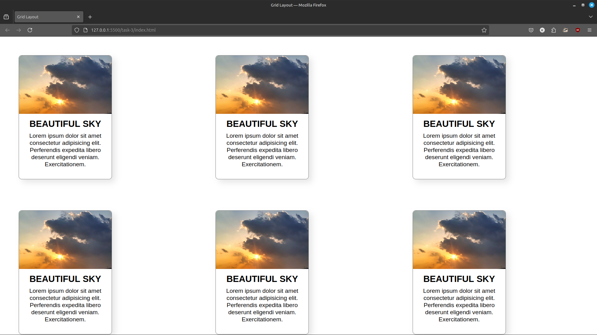
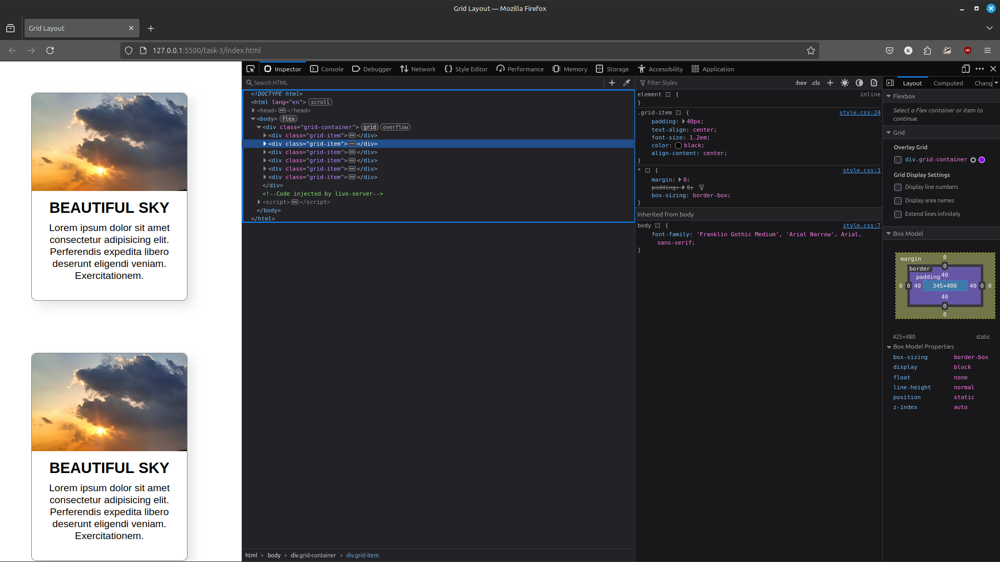

# Task 3: Responsive Grid Layout

## Overview

This project demonstrates a **responsive grid layout** created using HTML and CSS. The layout is designed to display multiple items in a grid format, adapting seamlessly to different screen sizes using CSS Grid and media queries.

## Features

- **Grid Layout**:
  - Displays items in a three-column layout on larger screens.
  - Automatically adjusts to a single-column layout on smaller screens (mobile devices).
- **Responsive Design**:
  - Uses media queries to ensure the layout adapts to different screen sizes.
- **Clean and Consistent Styling**:
  - Items are evenly spaced with consistent alignment and padding.

## Preview

The webpage includes:
- **Grid Container**: A flexible grid layout that holds multiple items.
- **Grid Items**: Individual items styled with padding, background color, and rounded corners.

### Desktop Layout

### Mobile Layout

