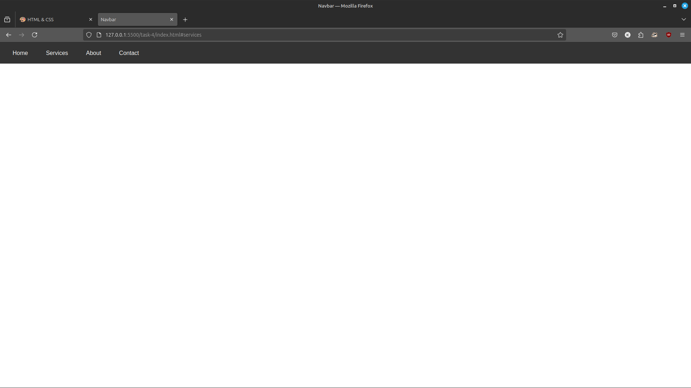
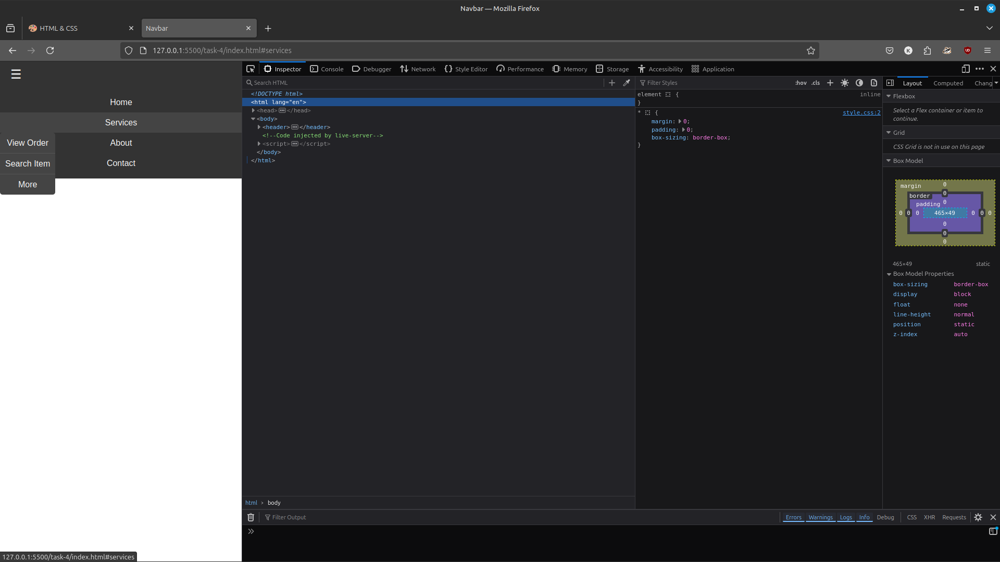

# Task 4: Responsive Navbar with Dropdown

## Overview

This project demonstrates a **responsive navigation bar** with a dropdown submenu. The navigation bar adapts to different screen sizes using HTML and CSS.

## Features

- **Dropdown Menu**:
  - Submenu appears on hover for desktop users.
- **Responsive Design**:
  - Collapses into a toggleable menu on mobile devices.

## Preview

The webpage includes:
- **Navbar**: A horizontal navigation bar with a dropdown submenu.
- **Responsive Behavior**:
  - Desktop: Dropdown menu appears on hover.
  - Mobile: Navigation bar collapses into a vertical layout.

### Desktop Layout

### Mobile Layout
