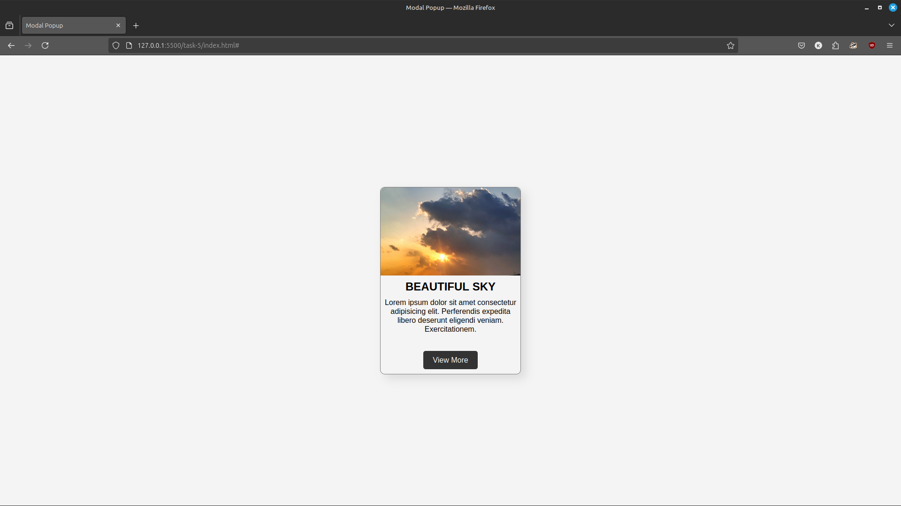
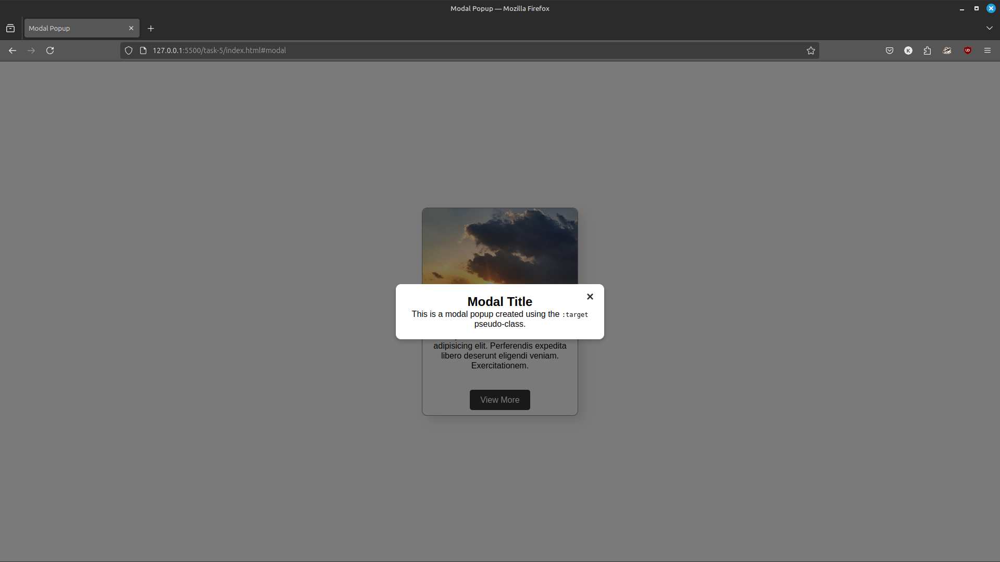

# Task 5: Modal Popup

## Overview

This project demonstrates a **modal popup** created using HTML and CSS. The modal is triggered using the `:target` pseudo-class, without any JavaScript.

## Features

- **Modal Popup**:
  - Opens when the "View More" button is clicked.
  - Includes a close button to hide the modal.
- **Smooth Transitions**:
  - The modal appears and disappears with a fade effect.
- **Responsive Design**:
  - The modal is centered and adapts to different screen sizes.

## Preview

The webpage includes:
- **Card Component**: Displays an image, title, and description with a "View More" button.
- **Modal**: A popup window with a title, description, and close button.

### Before Opening Modal

### After Opening Modal
