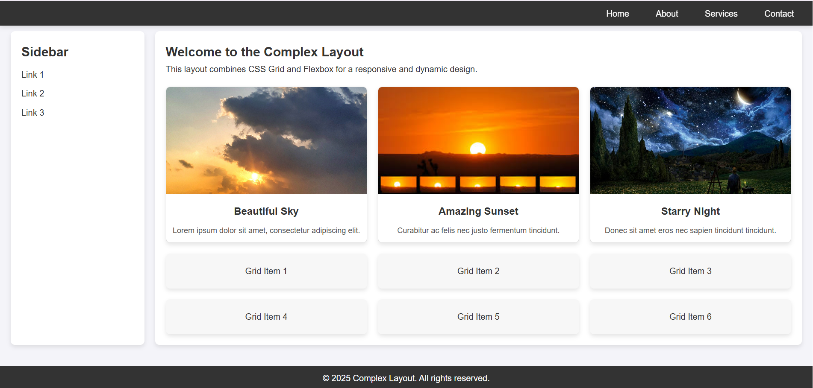

# Complex Responsive Layout with Grid and Flexbox

This project demonstrates a **Complex Responsive Layout** that combines **CSS Grid** and **Flexbox** techniques to create a sophisticated webpage design. It includes a sticky header, sidebar, card section, and a responsive grid layout.

## Question

**Complex Responsive Layout with Grid and Flexbox**

- **Objective:** Design a sophisticated webpage layout that combines CSS Grid and Flexbox techniques.
- **Requirements:**
  - Use CSS Grid to structure the main layout and Flexbox to handle the alignment and spacing of inner elements.
  - Create overlapping elements (using `position` and `z-index`) and dynamic reordering based on viewport size.
  - Implement a sticky header or sidebar that remains visible as the user scrolls.
## Preview

